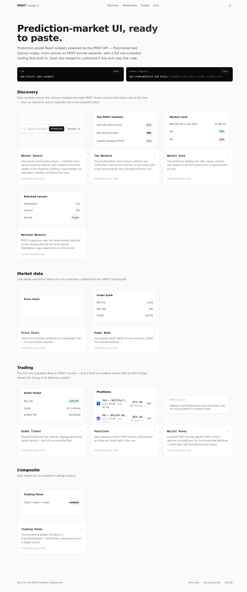
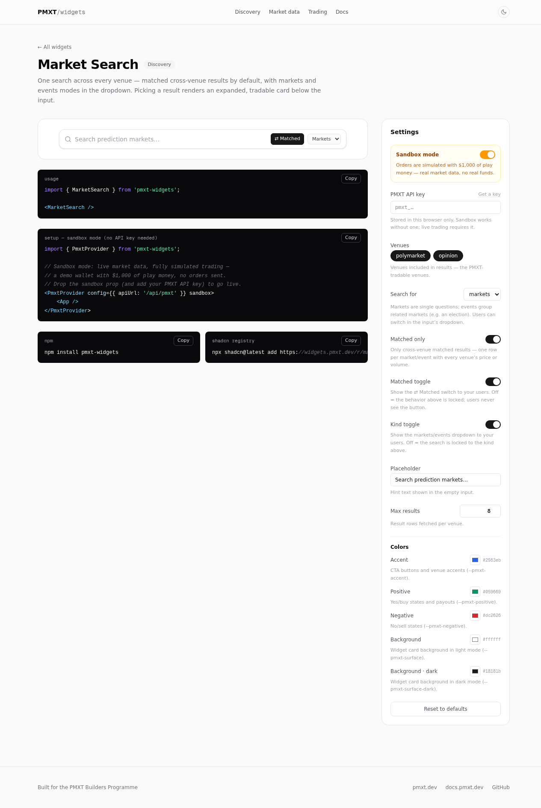

# PMXT Builder Widgets

React widgets that let your users discover prediction markets and trade them inside your product. PMXT handles the multi-venue trading rail; you get a fast UI path to a new outcome: collect fees on your users' trading activity.

- One integration for Polymarket and Opinion today, with more venues as PMXT escrow expands.
- Discovery widgets turn into trade tickets automatically: users click an outcome, sign, and trade.
- Works as copy-paste shadcn-style components or as a versioned npm package.
- Sandbox mode lets you demo the full flow with play money before going live.



## Get started in 5 minutes

1. Create a PMXT account: https://pmxt.dev
2. Enable builder mode in your dashboard.
3. Create an API key: https://www.pmxt.dev/dashboard/api-keys
4. Add the widgets to your app.
5. Route widget requests through a tiny server-side proxy so your PMXT key stays private.

Install from npm:

```bash
npm install pmxt-widgets
```

Or copy one widget into your codebase with the shadcn registry:

```bash
npx shadcn@latest add https://widgets.pmxt.dev/r/order-ticket.json
```

Then render a market search. Picking an outcome opens an inline trading card with no extra wiring:

```tsx
import { MarketSearch, PmxtProvider } from 'pmxt-widgets';

export default function App() {
    return (
        <PmxtProvider config={{ apiUrl: '/api/pmxt', tradeUrl: '/api/trade' }}>
            <MarketSearch venues={['polymarket', 'opinion']} />
        </PmxtProvider>
    );
}
```



## What you can ship

### 1. Market discovery

Use `MarketSearch`, `TopMarkets`, `MarketCard`, `EventCard`, `MatchedMarkets`, and `MarketTicker` to help users find high-volume markets across venues.

Best for: search boxes, home-page market feeds, event pages, newsletters, and trading dashboards.

### 2. Live market data

Use `PriceChart`, `OrderBookWidget`, `ExecutionQuote`, and `RecentTrades` to show the data users need before placing a trade.

Best for: research pages, market detail pages, and power-user dashboards.

### 3. Trading and wallet flows

Use `OrderTicket`, `InlineTradePanel`, `TradingPanel`, `Positions`, `OpenOrdersTable`, `TradeHistory`, `BalanceCard`, and `WalletPanel` to run the full PMXT trading flow.

Best for: embedded trading, portfolio pages, deposit/withdraw UX, and one-click sell flows.

## The simple mental model

Your app owns the user experience. PMXT supplies the trading API and escrow flow.

1. Your user discovers a market in a widget.
2. The widget asks your server proxy for a quote.
3. The user signs the order in their wallet.
4. PMXT submits the trade to the selected venue.
5. Builder fees are attributed to your PMXT builder account.

## API keys and proxies

Every live widget request uses a PMXT API key. Keep that key on your server; never ship it to the browser.

Your browser should call your own routes:

```tsx
<PmxtProvider config={{ apiUrl: '/api/pmxt', tradeUrl: '/api/trade' }}>
    <App />
</PmxtProvider>
```

Those routes should forward to PMXT with:

```http
Authorization: Bearer YOUR_PMXT_API_KEY
```

The demo app includes copyable reference routes:

- `apps/demo/app/api/pmxt` for read-only market data
- `apps/demo/app/api/trade` for trading requests

## Try sandbox mode first

Sandbox mode uses live market data but simulated trading: a demo wallet, $1,000 of play USDC, quoted fills, balances, positions, open orders, and trade history. No real order reaches the trading API.

```tsx
<PmxtProvider config={{ apiUrl: '/api/pmxt' }} sandbox>
    <App />
</PmxtProvider>
```

Use sandbox mode for demos, onboarding, QA, and screenshots. Remove `sandbox` and add a live `tradeUrl` when you are ready for real trading.

## Tailwind setup

If you install from npm, include the widget package in your Tailwind content scan:

```css
/* globals.css (Tailwind v4) */
@source "../node_modules/pmxt-widgets/src";
```

Widgets support light and dark mode and read colors from CSS variables:

```css
:root {
    --pmxt-accent: #2563eb;
    --pmxt-positive: #059669;
    --pmxt-negative: #dc2626;
}
```

## Widget reference

| Outcome | Widgets |
| --- | --- |
| Find tradable markets | `MarketSearch`, `TopMarkets`, `MarketCard`, `EventCard`, `MatchedMarkets`, `MarketTicker` |
| Show venue + price primitives | `VenueBadge`, `PriceChip` |
| Show market data | `OrderBookWidget`, `PriceChart`, `ExecutionQuote`, `RecentTrades` |
| Let users trade | `OrderTicket`, `InlineTradePanel`, `TradingPanel` |
| Manage account state | `WalletPanel`, `BalanceCard`, `Positions`, `OpenOrdersTable`, `TradeHistory` |

All widgets are self-contained React components with Tailwind classes and no runtime chart/query/icon dependencies. Data flows through `PmxtProvider` and small built-in polling hooks.

## Trading model

Trading is non-custodial and uses the PMXT hosted trading API:

1. `OrderTicket` quotes with `POST /v0/trade/build-order` and receives a `built_order_id`, quote, and EIP-712 `typed_data`.
2. The user signs in their wallet. You can use the injected wallet by default or pass your own signer through `PmxtProvider` for wagmi, Privy, or embedded wallets.
3. `POST /v0/trade/submit-order` executes with the `built_order_id` and signature.

Account reads use `GET /v0/user/{address}/balances|positions|trades` and `GET /v0/orders/open`. Cancels use `/v0/orders/cancel/build` then `/v0/orders/cancel`.

Funds live in the user's PMXT escrow balance. Users can deposit at https://pmxt.dev/dashboard/wallet or through `WalletPanel`.

## Develop locally

```bash
pnpm install
cp apps/demo/.env.example apps/demo/.env.local   # add PMXT_API_KEY
pnpm dev                                          # demo on :3017
pnpm test                                         # widget unit tests
pnpm registry                                     # build /r/*.json registry items
pnpm build                                        # build package + demo
```

Repo layout:

```text
packages/widgets    pmxt-widgets package source
apps/demo           Next.js showcase, API proxy examples, registry host
```
