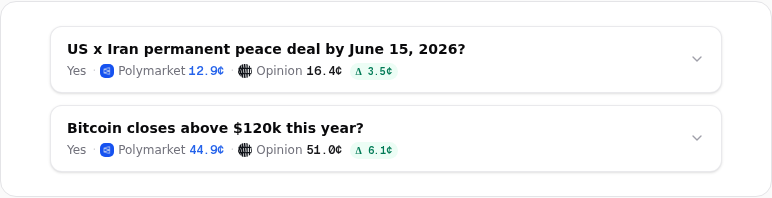
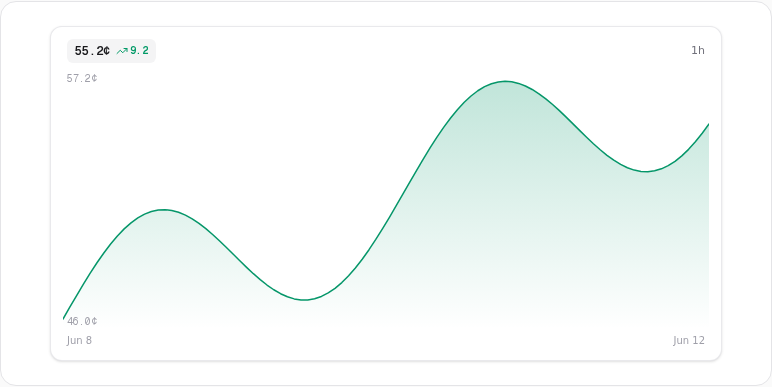
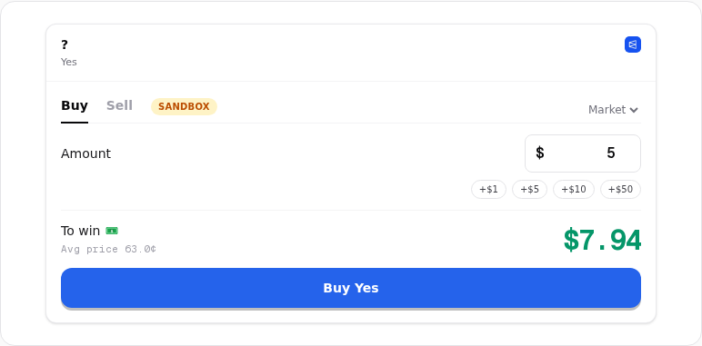

# PMXT Builder Widgets

Drop-in React widgets for prediction-market trading. Let users trade inside your app while PMXT handles routing, escrow, signing, and builder-fee attribution.

## What you get

- Search and matched-market discovery across PMXT venues
- Live charts and order books
- Non-custodial buy/sell tickets
- Sandbox mode for demos before real funds

| Matched markets | Live chart |
| --- | --- |
|  |  |

| Order ticket |
| --- |
|  |

## Install

```bash
npm install pmxt-widgets
```

Or copy a widget into your app:

```bash
npx shadcn@latest add https://widgets.pmxt.dev/r/order-ticket.json
```

## Use

```tsx
import { MarketSearch, PmxtProvider } from 'pmxt-widgets';

export default function App() {
    return (
        <PmxtProvider config={{ apiUrl: '/api/pmxt', tradeUrl: '/api/trade' }}>
            <MarketSearch venues={['polymarket', 'opinion']} />
        </PmxtProvider>
    );
}
```

Clicking an outcome opens a tradable card. Your user signs; PMXT routes the trade; your builder account gets attributed.

## Go live

1. Sign in at https://pmxt.dev.
2. Enable builder mode in the dashboard.
3. Create an API key at https://www.pmxt.dev/dashboard/api-keys.
4. Put the key on your server.
5. Point `apiUrl` and `tradeUrl` at proxy routes that add:

```http
Authorization: Bearer YOUR_PMXT_KEY
```

The demo includes reference proxies in `apps/demo/app/api/pmxt` and `apps/demo/app/api/trade`.

## Sandbox

```tsx
<PmxtProvider config={{ apiUrl: '/api/pmxt' }} sandbox>
    <App />
</PmxtProvider>
```

Sandbox uses live market data with simulated trading, balances, positions, and fills.

## Develop

```bash
pnpm install
cp apps/demo/.env.example apps/demo/.env.local
pnpm dev
pnpm test
```
